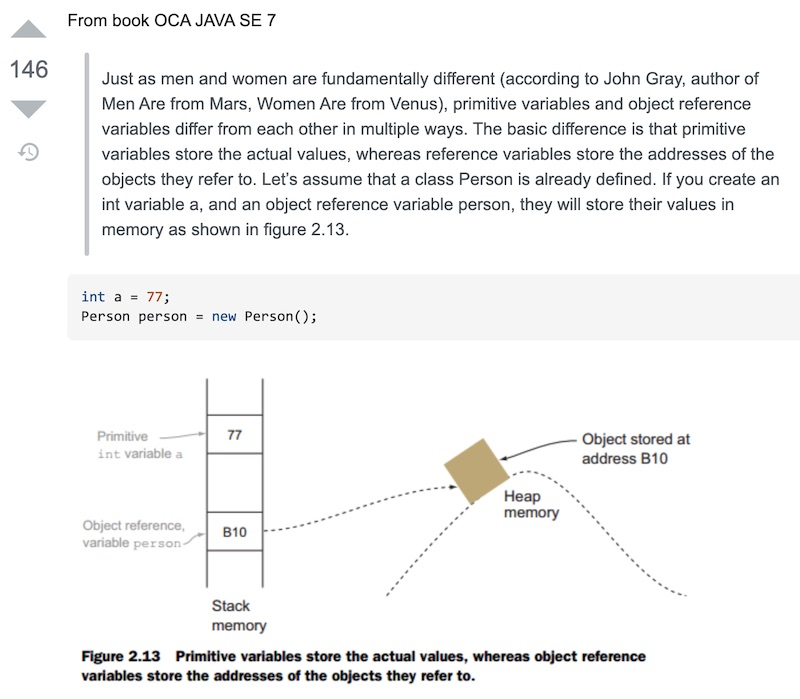

# JS Fundamentals

- *all of the code below is running in either [strict mode](https://developer.mozilla.org/en-US/docs/Web/JavaScript/Reference/Strict_mode), or in an ES6 module*

## I. Javascript primitive types (aka value) v. Reference Types

- A JavaScript *primitive type* (e.g. `Number`, `Boolean`, `null`, `undefined`) has a fixed size in memory. For example, `Number` occupies eight bytes of memory (32 bits), and a `Boolean` value can be represented with only one bit. We say that these types are stored *by value*.
- `Object` and `Array` types do not have a fixed size. Instead, the variable stores a *reference* (e.g. pointer or memory address) to the value. This reference is not the data value itself, but it tells the variable where to look to find the value.
- Strings ARE variable size (like reference types), but because in JavaScript they are *immutable*, they behave like value types (see the HW below)
- Handy resources:
  - https://www.educative.io/courses/step-up-your-js-a-comprehensive-guide-to-intermediate-javascript/7nAZrnYW9rG
- Here is a great visual example from a [Stack Overflow Post](https://stackoverflow.com/questions/8790809/whats-the-difference-between-primitive-and-reference-types). The language used is Java, but it nicely illustrates how "primitive variables store the actual values, whereas reference variables store the addresses of the objects (located on the system *heap*) that they refer to"



<hr>

### I-A. *Value* type example

```js
function valueTypeTester(){
	let a = 3.14;            // Declare and initialize a variable
	let b = a;               // Copy the variable's value to a new variable
	a = 3;                   // Modify the value of the original variable
	console.log(`a = ${a}`); // Displays 3 as expected
	console.log(`b = ${b}`); // Displays 3.14; the copy has not changed
	/* Thus `a` and `b` "contain" different values! */
}
valueTypeTester();
```

### I-B. *Reference* type example

```js
function referenceTypeTester(){
	let a = [1,2,3];         // Initialize a variable to refer to an array
	let b = a;               // Copy that reference into a new variable
	a[0] = 100;              // Modify the array using the original variable's reference
	console.log(`a = ${a}`); // Display the changed array [100,2,3] via the original variable
	console.log(`b = ${b}`); // Display the changed array [100,2,3] via the new variable
	/* Thus `a` and `b` are pointing at the same array! */
}
referenceTypeTester();
```

<hr>

## II. Debugging


- https://www.cs.cornell.edu/courses/cs312/2006fa/lectures/lec26.html

## XXX. Homework

**Submission: modify the HTML template below as instructed, rename the file to *Lastname-Firstname-js-fundamentals.html*, and then ZIP and POST it to the myCourses dropbox prior to the due date:***

1A) Prove that the JavaScript `String` type is a *value type* by re-writing the `valueTypeTester()` function in the I-A. example above so that it utilizes this string - `"Joe"` - instead of a number 

1B) Prove that the JavaScript `Object` type is a *reference type* by re-writing the `referenceTypeTester()` function in the I-B. example above so that it utilizes an object instead of an array. Do so with this [Object literal](https://developer.mozilla.org/en-US/docs/Web/JavaScript/Reference/Operators/Object_initializer) - `let a = {name: "Joe", age: 78 };` 

2A) Read the article linked in 


**Coder-Ace-js-fundamentals.html**

```html

```


