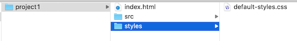

# Project 1 - *Interactive Sandbox* (DRAFT)

[I. Overview](#overview)

[II. Theme & Impact](#theme)

[III. Media](#media)

[IV. Code](#code)

[V. User Experience](#user-experience)

[VI. Examples](#examples)

[VII. Rubric](#rubric)

[VIII. Documentation & Submission](#submission)

<a id="overview"/>

## I. Overview

You (optionally, with a partner) will create a compelling interactive media experience that allows the user to explore a media-related theme (of your choice)

<a id="theme"/>

## II. Theme & Impact
- Explore **one** of the *themes* that we covered in class:
  - *Randomness*:
    - Random walks --> see [HW-random-walker.md](https://github.com/tonethar/IGME-330-Master/blob/master/notes/HW-random-walker.md)
    - Procedural Noise (Open Simplex, Perlin, ...) --> see the [simplex-noise-1.md](https://github.com/tonethar/IGME-330-Master/blob/master/notes/simplex-noise-1.md) page and the examples in myCourses  /// Where in myCourses?
  - *Dynamical Systems*:
    - Chaotic Systems --> see [HW - Lorenz Attractor](https://github.com/tonethar/IGME-330-Master/blob/master/notes/HW-lorenz-attractor.md)
    - Periodic functions --> see [HW - Sine Wave](https://github.com/tonethar/IGME-330-Master/blob/master/notes/HW-sine-wave.md)
    - Phyllotaxis --> see [HW - Algorithmic Botany](https://github.com/tonethar/IGME-330-Master/blob/master/notes/HW-algorithmic-botany.md)
  - *Emergence*:
    - Conway's *Game of Life* --> see [HW - Life](https://github.com/tonethar/IGME-330-Master/blob/master/notes/HW-canvas-life.md)
    - Reaction Diffusion --> RESOURCE: Coding Train [Coding Challenge #13: Reaction Diffusion Algorithm in p5.js](https://www.youtube.com/watch?v=BV9ny785UNc&t=1431s) /// This links to a specific time in video... reason?
  - **OR** ??? (getting permission in advance is required) - here are some ideas:
    - Evolution - YouTube [Primer's Evolution Playlist](https://www.youtube.com/watch?v=oDvzbBRiNlA&list=PLKortajF2dPBWMIS6KF4RLtQiG6KQrTdB)
    - Economic - YouTube [Primer's Economics Playlist](https://www.youtube.com/watch?v=PNtKXWNKGN8&list=PLKortajF2dPCAHWOVNqWY2DSEdoyyj1eV)
    - Generative Art - here's a great blog post to give you some ideas --> https://www.artnome.com/news/2018/8/8/why-love-generative-art
    - Particle systems/falling sand app: https://github.com/pineapplemachine/websand
      - /// maybe add: https://modernweb.com/creating-particles-in-html5-canvas/ 
    - https://medium.com/better-programming/heres-what-i-learned-from-30-days-of-creative-coding-a-codevember-retrospective-8c05a8497d24
    - [Intro to Creative Coding](https://github.com/mattdesl/workshop-p5-intro/blob/master/README.md)
    - Shiffman, of course: https://www.youtube.com/user/shiffman/featured
  - *Sprites* - do you need sprites for your Project? - [canvas-6.md](https://github.com/tonethar/IGME-330-Master/blob/master/notes/canvas-6.md) might help!
  - **Game?**
    - An interactive game, most likely in the "casual" genre, is also acceptable as a project
    - We like this definition of a game:
        - *"A game is a series of interesting choices"* - https://en.wikiquote.org/wiki/Sid_Meier - and you should strive to give your players some - examples:
          - *"When should I use one of my limited supply of  smart bombs to clear the screen?"*
          - *"Do I try to grab the powerup, or avoid that projectile?"*
          - *"Should I build a farm, or wait to save up enough to build a factory?"*
    - Other elements found in fun games you will probably have in yours:
      - A difficulty level that's not too hard, nor too easy
      - Score
      - Levels
      - Satisfying user control with mouse and/or keyboard (see 235 "Key Daemon" /// aka [Smooth Keyboard Control](https://github.com/tonethar/IGME-235-Shared/blob/master/tutorial/pixi-js-0.md#vi-demos) demo)
      - *Feedback loops* that change the flow of the gameplay - https://learn.canvas.net/courses/3/pages/level-4-dot-4-feedback-loops
      - *Emergent gameplay/complexity* (i.e. the players *learning* something that can improve their level success in the game) - https://learn.canvas.net/courses/3/pages/level-4-dot-5-emergence
- *Impact:*
  - This app is an *interactive sandbox*, similar to a physical sandbox where the user can experiment, create and destroy with no given objective.
    - /// or if adding game elements, be sure that the controls allow for the player to control the elements of the game to the greatest reasonable degree, possibly allowing for "options" in the way that the game can be played (for example, adjusting difficulty with a slider).
  - The app must do something that would be meaningful to the user, allowing them to explore the chosen theme in a compelling way
  - The code & functionality must go significantly beyond any of the provided "starter" code above
  - The creator of this app should take this assignment seriously ("engage"!) and do their **best work**
  - Here are some examples of the reverse (e.g. these are *counter examples* to be avoided):
    - not implementing specific requirements in the [rubric](#rubric) below
    - barely meeting "the minimum" on many elements of the rubric - for example:
      - writing *exactly* 3 utility functions
      - creating *exactly* 3 controls
      - using *exactly* 3 semantic HTML elements
      - having *exactly* 5 CSS style rules 
      - and so on, rather than letting the amount of these to be driven by what the app requires to work well and look good
    - copying/pasting CSS styles and layout from the demos and exercises, rather than creating their own
    - minimal modification/extension of the in-class code that was provided
 

<a id="media"/>

## III. Media
- Procedural drawing via the [CanvasRenderingContext2D](https://developer.mozilla.org/en-US/docs/Web/API/CanvasRenderingContext2D) that we have been utilizing in class is required. (Processing, Pixi.js, WebGL *et al* are NOT allowed):
  - canvas methods must be used for rectangles, arcs and lines
  - `ctx.save()` and `ctx.restore()` must be used
  - avoid using canvas convenience methods such `ctx.fillRect()` and `ctx.strokeRect()`
- HTML:
  - use semantic HTML where possible - `<header>`, `<footer>`, `<main>`, `<section>` (use at *least* 3 of these)
- CSS:
  - use an external CSS style sheet with at least 5 rules ("mobile friendly" CSS would be nice, but is not required)
  - an embedded font (ex. Google Fonts) is required
- Images:
  - if you end up using images, be sure that they are saved in a web-friendly format (JPEG, PNG or GIF) and *optimized* for web delivery. This means that their resolution (pixel dimensions) and file size are no larger than necessary.

<a id="code"/>

## IV. Code

### IV-A. File Naming Conventions
- The app file name is **index.html**
- Most of the app's code is in a file named **index.js**, which is linked from **index.html**, and located in an **src** folder
  - Most of the rest of the app's code is in your "User-created JS library" (see below)
- HTML/CSS/Image file names are [kebab-cased](https://wiki.c2.com/?KebabCase) - meaning all lower case letters -  NO spaces are allowed in file names, and dashes separate words - ex. NOT **myStyles.css** or **my styles.css**, INSTEAD USE **my-styles.css**:
- JS file names can be camel-cased in some cases. Here's an example of an exception to previous rule: 
  - *if a JS file contains a class named something like `FastCar`, you should forget about kebab-casing and instead name the file **FastCar.js***

### IV-B. Coding standards
- ES6 Modules, with at least 3 distinct JS files
- `let` and `const` only. `var` is NOT allowed
- For DOM traversal, use only `document.querySelector()` and `document.querySelectorAll()`
-  NOT allowed: `document.getElementById()`, `document.getElementsByTagName()`, `document.getElementByClassName()` etc
- [**D.R.Y.**](https://en.wikipedia.org/wiki/Don%27t_repeat_yourself) - "Don't Repeat Yourself" - avoid redundancy - multiple blocks of similar code should be factored out into functions
- Avoid ["magic numbers"](https://en.wikipedia.org/wiki/Magic_number_(programming)#Unnamed_numerical_constants) and instead declare these values as variables or constants
- "inline" event handlers - ex. `<button onclick="doStuff();">My Button</button>` are NOT allowed

### IV-C. User-created JS Module
- Probably named **utils.js**:
  - contain some or all of utility functions that we created in class (such as `getRandomColor()`, `getRandomInt()`, `drawRectangle()` etc ...) - depending on the needs of your project
  - contain at least 3 (and probably more) useful utility functions that were **created by you**
  - as "utility" functions these must be "pure functions" - see these notes --> [pure-function-notes.md](https://github.com/tonethar/IGME-330-Master/blob/master/notes/pure-function-notes.md)
  
### IV-D. Third-party libraries
- NOT allowed without advance approval (drawing libraries like *EaselJS* are not allowed, but don't be afraid to ask about others (Physics libraries, etc) - just shoot the prof an email!)

### IV-E. Version Control
- You are required to have your project code posted to a GitHub repository 
- If you don't have a GitHub account, go get one now - https://education.github.com/
- For this project, because of the small number of files you will be working on (with potentially a partner, and with a high likelihood of *merge conflicts*)  - you can interact with the repository however you wish:
  - GitHub's web interface
  - A Git GUI app like [GitHub Desktop](https://desktop.github.com/)
  - Using a command-line client like [GitBash](https://www.stanleyulili.com/git/how-to-install-git-bash-on-windows/)

### IV-F. File Structure

- Your file structure (locally and on GitHub and on banjo) should look like this:

- and:

  

<a id="user-experience"/>

## V. User Experience
- Usability:
  - the purpose of the app and how to use it should be obvious
  - users should be able to figure out how to use the app with minimal instruction
  - the app must run without errors
- Text Content:
  - title the app - in a &lt;title> element (this helps with bookmarking and search engines)
  - title the app - in an &lt;h1></h1> element, probably using an embedded font
  - a description of what theme the project is exploring
  - instructions on how to use the app
  - if needed, use the `title` attribute of HTML elements to provide tooltips to the user
- Controls:
  - *At least* 3 distinct DOM controls that have a **meaningful effect on the experience** by allowing the user to adjust various parameters of the experience, in at least 2 of the following categories:
    - buttons (pause and play buttons DO NOT count towards this requirement)
    - sliders
    - pulldowns
    - radio buttons
    - checkboxes
  - where appropriate, HTML controls should have labels with `for` attributes to make UI element selection easier
  - Mouse interaction would be a nice plus, but is not required

<a id="examples"/>

## VI. Examples

- FYI - These screenshots are from previous semesters when the course had 3 projcts, thus the scope expectations were lower
- We will look at some other examples in class

### Spiral Generator (Procedural flower petal generation - *phylotaxis*)

### Conway's Game of Life

<a id="rubric"/>

## VII. Rubric
  
  Your project will be graded on the following criteria:

| Criteria | Weight | Your Score |
| -------- | ------ | ---------- |
| **A. [Overall Theme/Impact](#theme)** | **50** | |
|    1. Does the app have an coherent and identifiable theme? | |
|    2. Does the app work as intended and it is reasonably engaging (both visually and otherwise)? | |
|    3. Does the app functionality and programming go beyond what we did in class? | |
|    4. Is the app at least *approaching/approximating* "portfolio quality" that you would not hesitate to show a potential employer? | |
|    **Overall:** Excellent/Outstanding/"Wow" (A+ = 50/50), Very Good (A = 45/50), Good (35-40/50), Fair (25-35/50), Poor (15-25/50), Unacceptable (0-15/50) ||
| &nbsp; | &nbsp; |
| **B. [User Experience](#user-experience)** | **20** | |
|    1. The purpose of the app and how to use it are obvious | |
|    2. Users should be able to figure out how to use the app with minimal instruction. The app runs without errors | |
|    3. Has required text content | |
|    4. Has required controls. Widgets are well labeled and follow interface conventions | |
|    5. Runs without errors | |
|    6. Visual design is pleasing (or at a minimum, "not ugly") | |
|    - *Missing controls* | *(-5 each)* |
|    - *Errors* | *(-? depending on severity)* |
|    **Overall:** You should aim to score 20/20 in this category ||
| &nbsp; | &nbsp; |
| **C. [Media](#media)**  | **15** | |
|    - *CSS does not pass validation* | *(-5)* |
|    - *HTML does not pass validation* | *(-5)* |
|    - *Missing required semantic HTML elements* | *(-5)* |
|    - *Majority of CSS is not in an external stylesheet* | *(-5)* |
|    - *Missing an embedded font* | *(-5)* | |
|    - *Images not properly optimized* | *(-5)* | |
|    - *Did not use `canvas.save()` or `canvas.restore()`* | *(-5)* | |
|    - *Did not draw rectangles, arcs, and lines* | *(-10)* | |
|    - *Did not use canvas API* | *0 grade on project* | |
|    **Overall:** You should aim to score 15/15 in this category ||
| &nbsp; | &nbsp; |
| **D. [Code](#code)**  | **15** | |
|    - *File Naming standards NOT followed (per incident)* | *(-1 to -5)* |
|    - *Code standards NOT followed (per incident)* | *(-1 to -5)* |
|    - *Inline event handlers used* | *(-5)* |
|    - *Missing/improperly implemented ES6 Modules* | *(-15)* | |
|    **Overall:** You should aim to score 15/15 in this category ||
| &nbsp; | &nbsp; |
| **Total Points Possible** | **100** | |
| &nbsp; | &nbsp; |
| **Other Deductions** | **&darr; Don't lose points for any of these! &darr;** | |
| *Deduction if required prototype is not submitted to dropbox on time* | *(-10)* | |
| *Deduction if final and complete documentation is not submitted to dropbox on time* | *(-10)* | |
| *-15% late penalty 0-24 hours after due date, -15% 24-48 hours and so on, means a maximum grad of 85% on any project that is submitted late* | *(-??)* | |

<a id="submission"/>

## VIII. Documentation & Submission
- Documentation is required:
  - *It's a good idea to document things as you are working on the project. Consider setting up a google doc right away so that you can posts links and other information there as you are working*
  - Elucidate how you met the 4 categories of requirements, and be specific about any extras you did - i.e. what code you wrote, where you went "above and beyond", and so on
  - Discuss what went right and what went wrong. List what features you would have liked to add to the project if you'd had more time/energy
  - Declare any non-course resources (libraries, sounds, images, tutorials, sample code) you utilized, in both your code comments, and in the final documentation of the project. Note: You don't have to document that you used the code we gave you in class
  - Grade the overall project and justify it. Use a grade of 0-100%.
- See dropbox for deliverables and due dates
